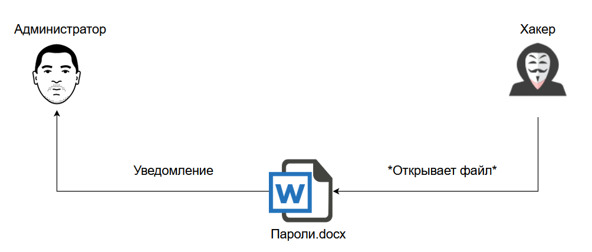
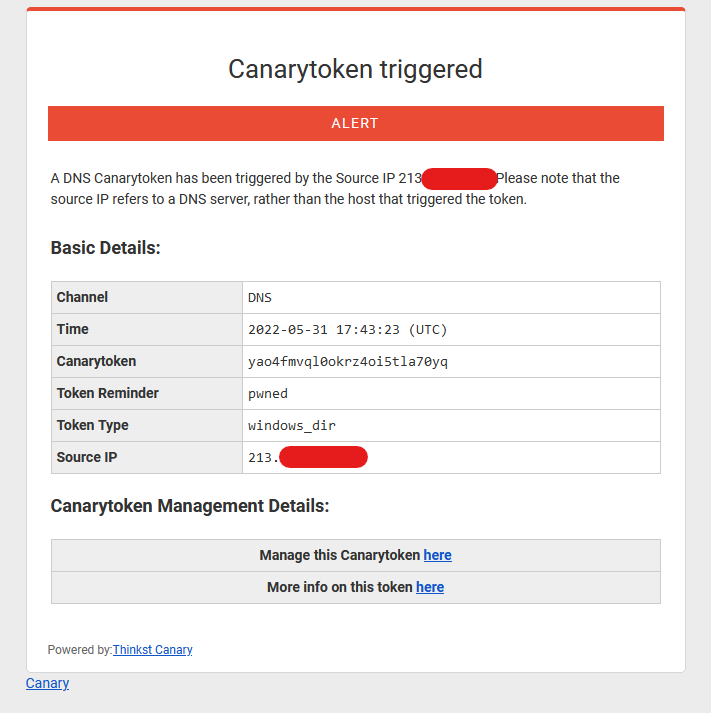

# Канарейки

Канарейки очень чувствительны к примесям опасных газов в воздухе.
Поэтому долгое время шахтёры брали их с собой в шахты: если птица
переставала петь, то это значило, что дышать воздухом становится
опасно.

Подобный же принцип используется и в информационной сфере. Многие
компании используют [уведомление пользователей](https://ru.wikipedia.org/wiki/Свидетельство_канарейки)
о том, что за ними никто не следит, чтобы при получении судебного
ордера *убрать* эту фразу. Тем самым компания даёт сигнал пользователям,
что отсутствие слежки больше не гарантируется.

Но мы собираемся скрываться не от корпораций, а от любопытных лиц.
Что мы можем предпринять?

## Canary tokens

Возможно, вы видели ссылки в биографии на странице ВК, которые никуда
не ведут (либо ведут в приложение "Узнай, кто за тобой шпионит" или
вроде того). Это простейшая форма канарейки.

Существует замечательный онлайн-сервис - [Canary Tokens](https://canarytokens.org/generate), который позволяет создавать своих собственных канареек.

Он позволяет создать различного рода канарейки, которые мы можем использовать для детектирования любопытных сотрудников вашей организации или обнаружить компрометацию ваших систем еще до того как злоумышленник сможет выполнить некоторые деструктивные действия.

Какие виды можно сгенерировать и при каких условиях будет получено уведомление:
-  URL-токен. При переходе по ссылке.
-  DNS-токен. При разрешение доменного имени.
-  AWS-ключи. При использовании ключа AWS.
-  Microsoft Word/Excel Document. При открытии файла.
-  Kubeconfing. При использовании Kubeconfig.
-  WireGuard VPN. При использовании конфига.
-  Cloned Website. При клонировании веб-сайта.
-  MySQL Dump. При загрузке дампа MySQL.
-  Windows Folder. При попытке открыть папку.
-  Fast Redirect. При попытке посетить сайт, с последующим перенаправлением.
-  Slow Redirect. При попытке посетить сайт, с последующим медленным перенаправлением, для получения большей информации.
-  Custom Image Web Bug. При просмотре вашей картинки.
-  Acrobat Reader PDF Document. При открытии PDF документа в Adobe Reader.
-  Custom exe / binary. При запуске исполняемых файлов.
-  SQL Server. При загрузке базы данных SQL Server.
-  SVN. При открытии папки SVN.
-  Unique email address. При отправке почты на электронный адрес.

Пример уведомления на почту:

*Раздел будет дополняться*

## Отличие от фишинга и ссылок-логгеров

*Раздел будет дополняться*

---

[Назад](./breach-detection.md) | [Оглавление](../README.md) | [Вперёд](./platforms.md)