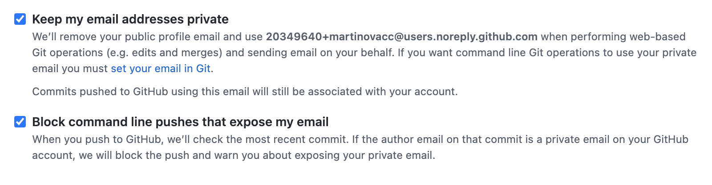

# Приватность для разработчиков

## Раскрытие своего почтового ящика

При работе с программным кодом и такими системами контроля версий как git существует риск раскрытия
своего персонального почтового ящика. Часто это происходит при одновременной работе с личными/рабочими проектами
на одном устройстве.

Чтобы избежать этого, проверяйте корректность настроек локального пользователя:
```
git config --global user.name
git config --global user.email
``` 

GitHub предоставляет возможность скрывать ваш email из интерфейса и блокировать "утечку" основного ящика, привязанного к аккаунту:



*Раздел будет дополняться*

---

[⬅️ Назад](./instagram.md) | [⏫ Оглавление](../README.md) | [➡️ Вперёд](./2fa.md)
