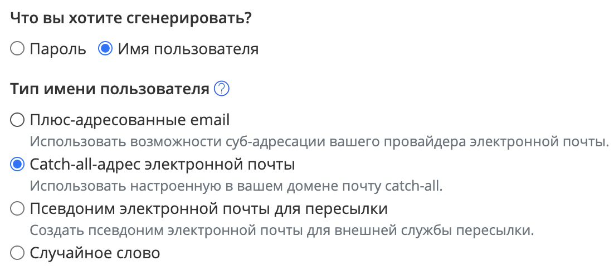

# Почтовый ящик

Адрес электронный почты был и остаётся самым распространённым идентификатором для аккаунта в Сети. У вас может не быть телефонного номера,
но у вас должен быть ящик - это неписанное правило.

Наличие электронной почты само по себе раскрывает о вас некоторую информацию. Прежде всего, это **алиас**, имя ящика, слева от символа
собаки "@". Первый и очевиднейший совет -- не стоит выбирать именем ваши инициалы, фамилию и год рождения, если это не сугубо личный
или рабочий ящик.

Второй, но немаловажный совет -- внимательно изучите провайдера электронной почты. Наиболее известные бесплатные сервисы почты "вдогонку" к email дают
вам аккаунты в других продуктах. Это относится прежде всего к Google и Яндекс, так как эти компании ведут свой бизнес в большом количестве
других сфер, и предоставить вам бесплатный ящик за то, что вы станете пассивным потребителем десятка других сервисов -- их хлеб.

## Разделение аккаунтов

Чтобы усложнить поиск информации о вас, рекомендуется использовать ящики с умом: используя техническую возможность создания вариаций ящиков.
Согласно официальным соглашениям, после алиаса и перед знаком @ вы можете указывать дополнительный суффикс с "+", например `nickname+facebook@google.com`.
Письма на такой электронный ящик будут приходить к владельцу `nickname@google.com`, но с точки зрения сайтов это будет совершенно другой ящик. У Google, к тому же, существует особенность: любые точки в алиасе рассматриваются как опциональные и работают как суффиксы после "+".

Существует несколько схем использования: уникальный ящик для каждого сервиса, уникальный ящик для каждой "личности" либо использование только для некоторых сервисов по известной только вам схеме.

Дополнительные преимущества использования суффиксов и точек описаны [здесь](./breach-detection.md#использование-алиасовфейковых-почтовых-адресов). Также вы можете проверить использование своего почтового ящика на разных сервисах с помощью инструмента [mailto_analyzer](https://github.com/soxoj/mailto_analyzer).

## Долой ящики для подписок, мусора и спама

Отдельно стоит отметить привычку большого количества людей использовать отдельный "мусорный" почтовый ящик для некритичных сервисов
и разнообразных спам-подписок. Само по себе разделение почтовых ящиков полезно, но только если оно сознательно (см. выше).

Если же вы не заглядываете в такой ящик, и письма там лежат непрочитанными тысячами и более, то это важный сигнал: разберитесь,
действительно ли вам нужен этот ящик. Если нет, то отпишитесь от всех рассылок и удалите связанные с ним аккаунты,
чтобы минимизировать вероятность использования этого email-адреса для сбора информации о вас.

## Одноразовые ящики электронной почты

Существует большое количество сервисов, предоставляющих одноразовые почтовые ящики на 10-15 минут.
Они хороши для одноразовых регистраций на сайтах, куда вы попадаете в первый раз и больше, скорее всего, не воспользуетесь.
Здесь рассмотрим те сервисы, которые создаются на случайных доменах.

Сервисы, генерирующие правдоподобно выглядящие алиасы (имя.фамилия):

- [TemporaryMail](https://temporarymail.com/)
- [MinuteInbox](https://www.minuteinbox.com/)

Другие популярные сервисы:
- [10minutemail](https://10minutemail.net)
- [TEMPMAIL](https://temp-mail.org/ru/)
- [Mohmal](https://www.mohmal.com/en)

## Общедоступные ящики электронной почты

Также в Интернете можно найти сервисы, которые дают возможность использовать **ваш алиас** для временного ящика.
Такие почтовые адреса удобно использовать для сервисов, в которых email должен выглядеть правдоподобно.

Примеры таких сервисов:

- [Maildrop](https://maildrop.cc/)
- [Mailsac](https://mailsac.com/)
- [templail+](https://tempmail.plus)
- [Yopmail](https://yopmail.com/) - также поддерживает пересылку (см. ниже)

## Пересылка почты с других почтовых ящиков

Сервисы, которые позволяют пересылать письма используют, так называемые "маски", позволяющие скрыть ваш настоящий электронный адрес.

Принцип работы очень простой:
- Адрес-маска получает письмо
- С этого адреса идет пересылка письма на ваш настоящий адрес

Пример на основе Firefox Relay:

Сначала предоставляется маска, которая скрывает настоящий адрес.


Теперь, используя данный адрес-маску мы можем получать письма на свой электронный адрес, не показывая его всему Интернету.


*Раздел будет дополняться*

Примеры сервисов:

- [SimpleLogin](https://simplelogin.io/)
- [AnonAddy](https://anonaddy.com/) - делает адреса по шаблону `*@ivanov.anonaddy.com`
- [Firefox Relay](https://relay.firefox.com/) - делает случайные адреса на домене `mozmail.com`
- [erine.email](https://erine.email/) - делает адреса по шаблону `*.ivanov@erine.email`

### Скрыть e-mail (Apple Hide My Email)

Apple даёт пользователям подписки **iCloud+** свой сервис маскирования почты — «Скрыть e-mail». Он доступен из настроек Apple ID на любом устройстве Apple и в браузере на iCloud.com, а при регистрации в Safari и в системном приложении «Пароли» предлагается как опция в поле ввода адреса.

Генерируются одноразовые адреса вида:

```
6g662b5nbb@privaterelay.appleid.com
gains-unworn0x@icloud.com
argosy-07raving@icloud.com
```

Письма с них пересылаются на «настоящий» ящик, привязанный к Apple ID; на них можно отвечать, и получатель увидит только маску. Адрес пересылки можно сменить в любой момент, а ненужные маски — удалить: после удаления поток писем и спама на эту маску сразу прекращается.

---

<details>
  <summary>🥷 Продвинутый уровень</summary>

## Использование личного домена для создания catch-all ящиков

*Раздел будет дополняться*

## Использование BitWarden для генерации алиасов электронной почты

Парольный менеджер BitWarden позволяет генерировать случайные алиасы почты с плюсом,
а также адреса catch-all почтовых ящиков и даже почтовые ящики для пересылки.



*Раздел будет дополняться*

</details>

---

[⬅️ Назад](./phone.md) | [⏫ Оглавление](../README.md) | [➡️ Вперёд](./fio-birthday.md)
