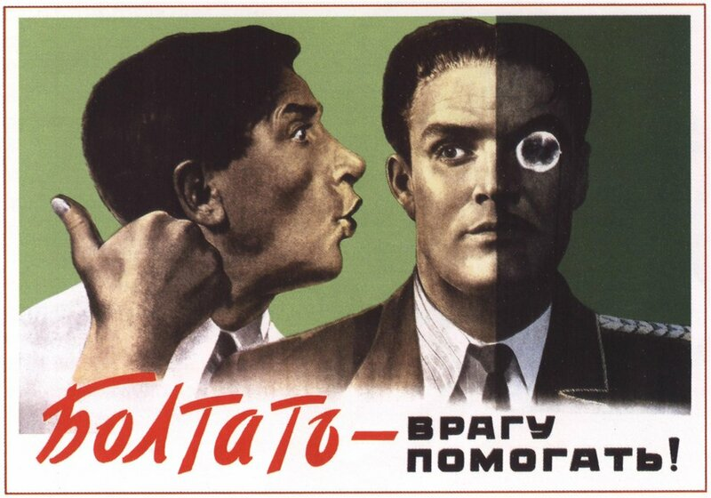
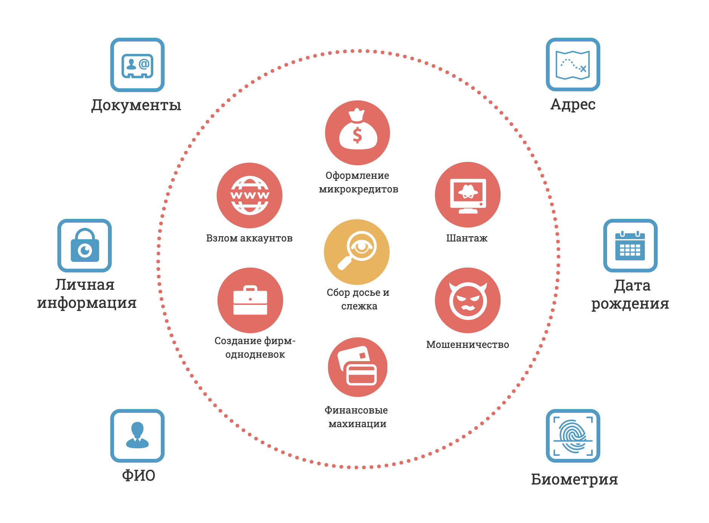

# Почему это важно

Трудно оставаться вне зоны доступа в наше цифровое время. Отшельник может иметь телефон для экстренной связи, а собака, хоть и не каждая, — аккаунт в Инстаграме.

Проникновение социальных сетей и средств связи могло бы быть исключительно позитивным, если бы не приводило к массе печальных последствий. От звонков фальшивых сотрудников Сбербанка с просьбой продиктовать пароль из СМС, и до коллекторов, внезапно требующих вернуть кредит, взятый на ваш паспорт.

В последние годы появился тренд на приватность и защиту информации о пользователях: GDPR, CCPA, LGBD. Компании обязали заботиться о сохранности персональных данных и о предотвращении их утечек. Но стали они собирать о нас меньше информации? Никак нет. Для них наши данные — источник прибыли. 

Но и ужесточения правовых норм для компаний недостаточно. Вы наверняка оставили много "хлебных крошек", потому что уже не первый год в Интернете. Старые аккаунты, объявления, публичные переписки, фотографии. По этим следам можно вплотную подойти к вам и использовать это в любых целях.  

---

*Интересный факт: в 2017 году журналистка [нашла анонимные аккаунты директора ФБР](https://gizmodo.com/this-is-almost-certainly-james-comey-s-twitter-account-1793843641) всего за пару часов. Достаточно было наводки о его существовании, информации о сыне и о дипломной работе по теологии.*

---

Огромные массив данных о людях, который возможно легко собрать подручными средствами, привёл к популярности OSINT — методологии сбора данных из открытых источников. Часто под этим термином сейчас подразумевают средства слежки за людьми, хотя изначально это методология разведки. Любое средство можно использовать как в благих, так и в плохих целях — об этом следует не забывать.

Поэтому важно иметь средства **Counter-OSINT** — инструменты для защиты своих данных и обеспечения приватности.

## Что будет в следующих главах

Разберём простые, но эффективные шаги, которые сильно затруднят сбор информации о вас стороннему наблюдателю. С конкретными пунктами и действиями.

Руководство будет полезно самому широкому кругу заинтересованных — не только тем, кто что-то слышал про OSINT, но и друзьям, знакомым, родителям. Инвестиция в полчаса на вдумчивое чтение и осознанные действия принесёт спокойствие и защиту от мошенничества, слежки, преследования, шантажа.

При этом не будем пренебрегать удобством. Многие руководства концентрируются на том, чтобы обезопасить себя по максимуму (даже если это не оправданно). Мы же будем исходить из необходимости соблюдения **баланса между приватностью и удобством**, при котором пользование Интернетом не будет осложнено.

---

Напомню, что OSINT — это сбор информации из открытых источников. Но, к сожалению, часто в Сеть попадают такие чувствительные данные как базы номеров телефонов, паспортных данных и так далее.

Мало того — в РФ через "пробив" можно получить подробные сведения о владельце номера телефона, машины, квартиры из официальных государственных реестров и баз данных. К сожалению, многие люди готовы за деньги предоставить доступ к тому, что должно быть тщательно защищено.

Будем считаться с этим: невозможно обеспечить полную анонимность и удалиться из всех реестров, но возможно усложнить процесс поиска настолько, что злоумышленник не сможет зацепиться за информацию.

Таким образом, цель руководства — научить защищать общедоступные сведения и усложнять процесса поиска других сведений про вас.

### Определяем важную информацию

Чтобы понять, какие данные важнее и что следует больше защищать, необходимо знать современные реалии с поправкой на Рунет. Это мы и разберём далее, и чтобы попытаться быть объективными, используем OPSEC.

Термин OPSEC, как и OSINT, пришёл из американской разведки. Он означает процесс анализа и защиты критически важной информации.

Для начала перечислим все **первичные данные**, которые так или иначе раскрывают нашу личность, но *существуют физически вне Интернета*. 

- Фамилия, имя, отчество
- Дата рождения
- Паспортные данные (серия, номер и т.д.)
- Физический адрес
- Личные документы (водительское удостоверение и т.д.)
- Биометрические данные
- Прочая личная и идентифицирующая информация

Таких данных не так много. Но, имея хотя бы часть, можно притвориться вами и обмануть третих лиц. Например, разослать знакомым сообщение с просьбой срочно перевести деньги из-за трудной ситуации.

При этом мошенники не обязательно будут заинтересованы конкретно в вашей личности. Например, они могут купить базу и сотни "свежих" паспортов, чтобы привязывать паспортные данные к электронным кошелькам QIWI для увеличения лимитов по выводу денег.

Любые личные данные могут быть использованы. Например, восстановление доступа к аккаунтам социальных сетей часто требует ответить на контрольный вопрос. Таким образом, знание девичьей фамилии матери или любимого музыканта повышает шансы взломать вас.

---

*Интересный факт: [в 2012 произошел громкий случай](https://habr.com/ru/post/149179/) захвата сразу 4 аккаунтов человека при знании только лишь адреса, имени и email. Элегантная цепочка восстановления доступа — сначала использовать известные данные, потом привязать фальшивые — позволяла сначала завладеть доступом в Amazon, GMail, Apple, Twitter, а потом и вовсе удалённо стереть данные с устройств человека.*

---

Возможно, вас смутил пункт "биометрические данные", но, увы, их использование уже давно вошло в нашу жизнь. Уже давно распространены средства поиска по лицу, которые используют те же технологии, что и для разблокировки личного телефона через переднюю камеру, а также обширные базы данных из социальных сетей. Когда вы оставляете свою фотографию в Сети, вы оставляете возможность найти себя.

### Анализируем угрозы

В соответствии с процессом OPSEC проанализируем, кто может быть заинтересован в подобных действиях и как может использовать информацию о нас. Давайте рассмотрим популярные случаи использования первичных данных на схеме ниже и попробуем сделать выводы. 

Что можно сделать с нашими данными?
Наверняка вы обратили внимание, что большинство пунктов связано с **получением денег**. Думаю, финансовая мотивация мошенников не требует объяснения. Единственное, что следует отметить — деньги могут быть похищены не только у вас, но и у других лиц. В этом случае критичным для нас становится участие в уголовном процессе, куда могут привлечь как свидетелем, так и обвиняемым. 

Выгода от сбора полной информации о вас, включая доступ к перепискам, менее определена. Это может быть как бытовое преследование, так и шпионаж, шантаж и прочее. Ясно только, что в большинстве случаев это **причинение личного вреда и вторжение в частную жизнь**.

Эти угрозы понятны и объяснимы, а во многих случаях регулируются законом. Статьи, связанные с финансовыми потерями, перечислять нет смысла, настолько их много; а сбор личных данных — это 137 УК РФ. Однако, давайте взглянем правде в лицо: требуется серьёзная причина, чтобы идти и самостоятельно форсировать возбуждение дела, а участие в таких процессах — стресс. Поэтому вернёмся к уже озвученной выше позиции: наша цель в том, чтобы защитить свои данные и избежать угроз.

---

Очевидно, что знания первичных данных недостаточно для проведения мошеннических схем. Таковые обычного основаны на социальной инженерии и предполагают дистанционное взаимодействие через звонок или сообщения. То есть, мы неявно подразумеваем, что у недоброжелателям уже известны наши **вторичные данные, виртуальные идентификаторы** — номер телефона, электронная почта, адрес аккаунта социальной сети. Таким образом, получение информации об этих данных несет в себе не меньшую угрозу.

Про каждый из типов данных дальше будет рассказано подробнее. А пока оставим своё внимание на том, что чем больше данных попадает в чужие руки, тем серьёзнее может быть исход. Отсюда вывод — количество данных о вас необходимо контролировать, не разбрасывать их где не следует и следить за их использованием.

Поговорим о **цифровой гигиене**.

---

[⬅️ Назад](./intro.md) | [⏫ Оглавление](../README.md) | [➡️ Вперёд](./hygiene.md)

