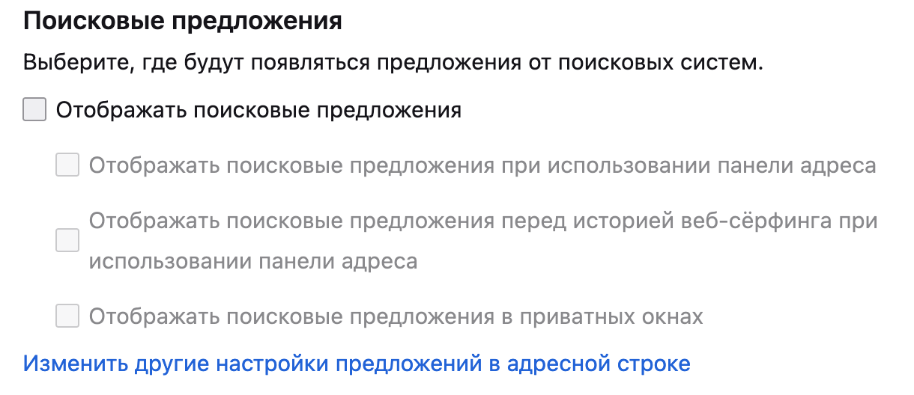
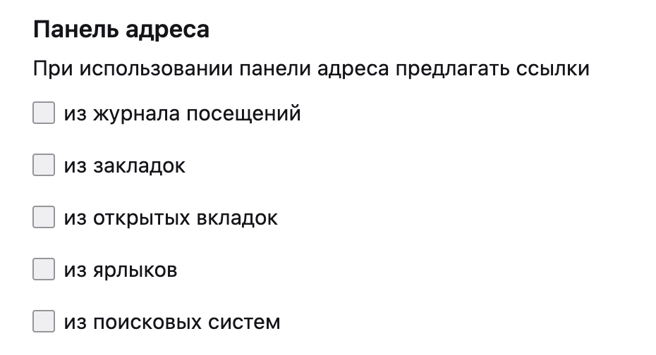

# Демонстрация экрана

В постковидное время удалённая работа стала нормой. Много людей созваниваются с коллегами в специально предназначенных для этого
приложениях: Zoom, Microsoft Teams, Google Meet и так далее. Одним из неотъемлемых атрибутов таких приложений является функция
демонстрации вашего экрана: чтобы показать собеседнику что-то, вы делаете видимым ваш работчий стол или отдельные окна, например, браузер.

Разумеется, это несёт с собой и риски раскрытия чувствительной информации. Оставим в стороне факт целенаправленного показа вами чего-то,
рассмотрим только случайные последствия:

- Переписки и сообщения в мессенджерах и соцсетях (во всплывающих окнах)
- Открытые вкладки в браузере или закладки
- Подсказки автодополнения во всех окнах ввода (особенно в адресной строке браузера)

Последняя категория может нести наибольший риск: при посимвольном вводе браузер будет пытаться предложить вам что-то из истории
недавнего посещения, поисковых запросов или закладок, имеющее хоть какое-то совпадение с символами (даже если это похожие буквы в любом месте).

Чтобы отключить это поведение, на Firefox можно снять все галочки в разделах "Поиск / Поисковые предложения" и "Приватность и Защита / Панель адреса".

---

[⬅️ Назад](./deleteme.md) | [⏫ Оглавление](../README.md) | [➡️ Вперёд](./russia.md)
